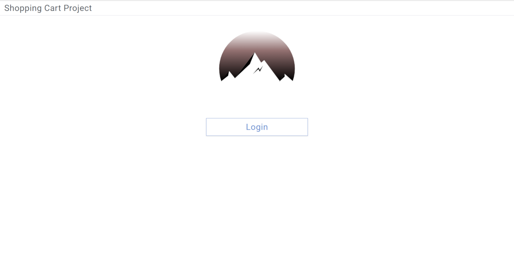

# Shopping Cart Project

Visit @ [Shopping Cart Project](http://shopping-cart-project.54.218.142.71.xip.io)

## Summary:

The Shopping Cart Project app is a simple implementation focusing on the interaction between a product list and a shopping cart. The primary purpose of the app is to show familiarity with sessions, state persistence through page refreshes, JavaScript unit testing with the Jest testing framework, JavaScript type checking with Flow, and a simple svg animation.

## Application Details:

**Login View**

This view starts the user as logged out with the option to login. Once the user clicks the 'login' button, the server will generate a unique key, a new user session will be initiated, and the user will be logged in.

**Main View**

This view displays a top navbar component, a list of 12 dummy products, and a shopping cart that is hidden by default.

**Navbar Component**

This component displays the app title, a shopping cart icon, the number of items in the cart, the total, and a logout button. The shopping cart icon will open / close the shopping cart component when clicked.

**Product Component**

This component displays the quantity of this product available in inventory, the product title, the product description, the product price, the quantity of this product in the cart, and a button to add this product to the cart.

**CartItem Component**

This component displays the product title, the product description, the product price, an increase / decrease button, and a delete button.

**Notes:**
- Design was implemented using Bootstrap classes. The Bootstrap custom form validation was also used.
- When either 'logout' or 'checkout' is clicked the app is completely reset back to its original state.

## Client-Side Technologies:

**Languages**

- CSS
- HTML
- JavaScript

**Libraries**

- React
- ReactDOM
- React Router DOM
- JQuery
- Popper.js
- Bootstrap
- UUID

**Linters**

- ESLint

**Type Checking**

- Flow

**Testing**

- Jest

**Build Tools**

- Babel
- Webpack

## Server-Side Technologies:

**Languages**

- Python

**Libraries**

- Flask
- Flask-SQLAlchemy
- Pipenv

**Database**

- SQLite

**Hosting**

- Amazon Web Services: Lightsail
- Ubuntu Server
- Apache HTTP Server